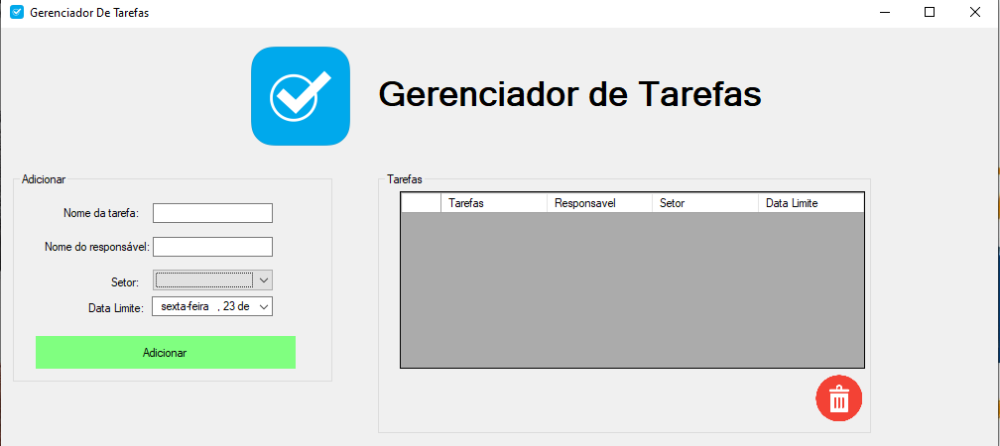

# Gerenciador de Tarefas
Um aplicativo simples de gerenciamento de tarefas desenvolvido em C# utilizando Windows Forms. Este software permite que os usuários adicionem tarefas com detalhes como nome, responsável, setor e data limite, visualizem a lista de tarefas e excluam tarefas conforme necessário, com uma interface amigável e intuitiva.

# Funcionalidades:
Adicionar Tarefas: Insira novas tarefas com nome, responsável, setor e data limite.
Listar Tarefas: Visualize todas as tarefas em uma grade organizada com colunas para tarefa, responsável, setor e data limite.
Excluir Tarefas: Remova tarefas selecionadas usando o botão de exclusão.
Persistência de Dados: As tarefas são salvas localmente em um arquivo JSON para manter os dados entre sessões.

# Como Usar:
- **Adicionar uma Tarefa**: Preencha os campos "Nome da tarefa", "Nome do responsável", "Setor" e "Data Limite".

- **Clique no botão "Adicionar" para incluir a tarefa na lista.**

- **Visualizar Tarefas**: A grade à direita exibe todas as tarefas com colunas para "Tarefa", "Responsável", "Setor" e "Data Limite".

- **Excluir Tarefas**: Selecione uma tarefa na grade e clique no botão vermelho de exclusão (ícone de lixeira).

- **Persistência: As tarefas são salvas automaticamente em um arquivo JSON no diretório do aplicativo.**

# Imagem do software

